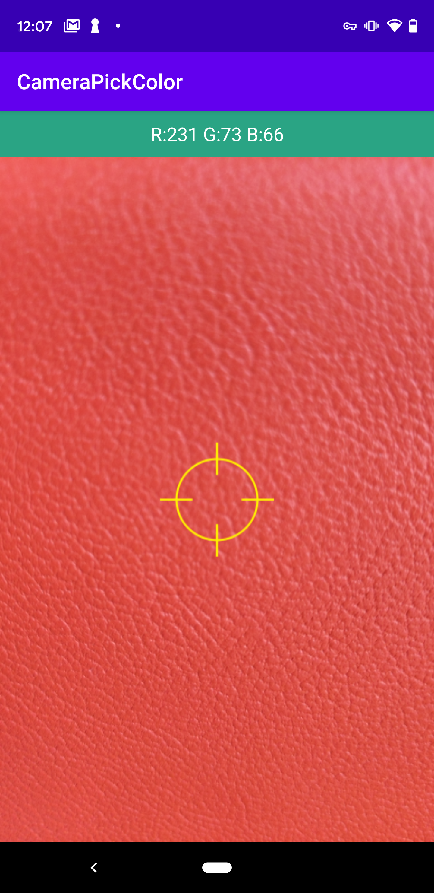

> 这本来是一个很久的历史demo，鉴于好多网友给我发email关注这个项目，这让我发现这个demo的价值，我决定继续维护并将其完善下去，希望这能为你的创意提供一点帮助。这将会是一个长期过程，为区分以前的版本，这里将初始的版本定为1.0，后续的版本将基于这个版本进行迭代，这个初始的的版本只是将原来的项目做一个迁移，并不涉及任何改动，其目的是为了迁移到AndroidStudio。

## 版本变化

### v1.0

- 重命名项目
- 项目迁移

## 效果展示

## 技术细节

待整理...
